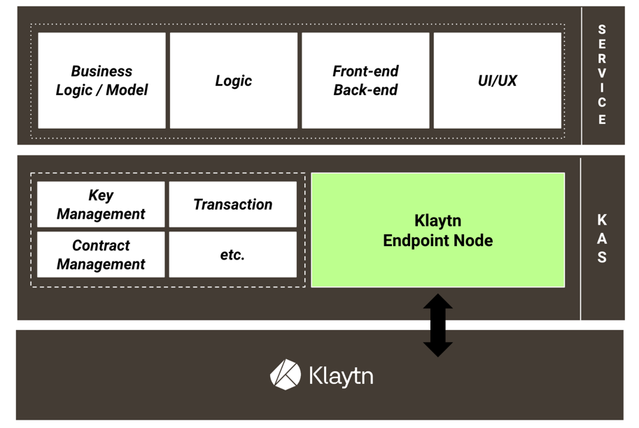

블록체인 기반 서비스를 개발하고 싶어 자료를 찾던 중 우연히 `BApp` 을 알게 되었고, 이에 대한 기술을 알아보겠습니다.

### BApp 개발의 기본이 되는 `Klaytn` 이란
먼저 간단하게 말하자면 "블록체인의 대중화 목표" 로 만든 블록체인 생태계라고 합니다.

Klaytn는 아래와 같은 특징이 있습니다.
1. 웹/모바일 애플리케이션과 동일한 수준의 사용자 경험을 제공하여 사용자가 블록체인을 인식하지 못하도록 함
2. 매력적인 애플리케이션이 많이 만들어질 수 있도록 비즈니스 친화적인 환경 제공
3. 블록체인의 핵심적인 특징을 희생되지 않으며, 적극적으로 헌신하는 참여자들과 안정적으로 플랫폼을 유지

즉, 헌신하는 참가자들과 함께 안정적으로 플랫폼을 유지하는 것이 목표!

이외 klaytn의 장점은 아래와 같습니다.
- 한번에 많은 양의 트랜잭션을 처리할 수 있음 
- Finality(완결성) 짧다는 점
- 트랜잭션 발생 시, 나오는 수수료(가스) 비용이 저렴함

### klaytn에서 사용하는 합의 알고리즘은 무엇이 다를까
| 비트코인                                     |이더리움|클레이튼|
|------------------------------------------|---|---|
| POW(Proof Of Work)   연산해서 작업을 증명하는 방식 |POS(Proof Of Stake)   지분을 통해서 합의하고 보상 받는 방식|IBFT(이스탄불 비잔티움 결함허용)   소수의 컨센서스 노드가 빠르게 검증하고, 블록을 생성하면 주변 프록시 노드들에서 그 결과를 전달하여 엔드 포인트 노드들에서 다수가 감시하는 시스템|

#### 여기서 **컨센서스(Consensus)** 란 
악의적인 상황이 발생하더라도 네트워크를 올바른 방향으로 이끌고자하는 다수의 노드들이 상호 검증을 거쳐 올바른 블록 생성을 이끌어내는 프로세스와 알고리즘을 말합니다.

### 그럼 BApp은 무엇일까
Blockchain App의 약자로 **klaytn 메인넷**을 기반으로 하는 애플리케이션을 말합니다.

### BApp 개발하는 방식
klaytn API Service 이용해 블록체인 서비스를 간단한 API 호출로서 개발을 하면 됩니다.

아래는 klaytn API Service 간단한 구조입니다.

 
학부생, 직장에서 배우기 쉽지 않은 blockchain, klaytn 에 대해 알아보면서 실제 블록체인 기반 서비스를 개발하고 싶다는 생각이 들었습니다. 추후에는 블록체인 기반 서비스를 간단한 사이드 프로젝트를 진행해보겠습니다.