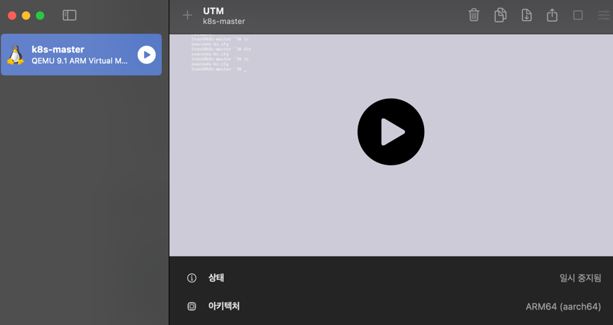

### 🔧 사용 환경 요약
- OS: macOS (M 시리즈 칩 기반)
- 가상화 도구: UTM (https://mac.getutm.app)
- VM 이미지: Rocky Linux 9.2 (ARM64)
- 사용 목적: 쿠버네티스 설치 및 테스트 환경 구성

### 📍 UTM의 네트워크 설정: Guest Network?
UTM에서 가상 머신을 만들 때, 네트워크 설정 중에 다음과 같은 항목이 있습니다.

- Network Mode: Shared Network
- Guest Network: 192.168.56.0/24
- DHCP Start / End: 예: 192.168.56.100 ~ 192.168.56.200
 
처음 보면 낯설 수 있는데, 이걸 회사 건물 비유로 아주 쉽게 풀어보겠습니다.

### 🏢 네트워크를 건물에 비유해보자
#### ✅ 1. Guest Network = "회사 건물의 주소 체계"
> 192.168.56.0/24  
> 이건 마치 “이 건물은 192.168.56.0 번지부터 192.168.56.255 번지까지 방이 있어요”라는 말입니다.

/24는 서브넷 마스크로, 256개의 주소(IP)가 있다는 뜻입니다.
실제 사용할 수 있는 IP는 192.168.56.1 ~ 192.168.56.254

#### ✅ 2. 가상 머신 = 입주자(직원)
UTM에서 만든 각 가상 머신(VM)은 이 건물에 들어오는 “직원”입니다.
이들은 방(즉, IP 주소)이 필요하죠.

#### ✅ 3. DHCP = 관리실 (자동 방 배정)
> DHCP는 "관리인"입니다.  
> 새로 들어온 직원(VM)에게 빈 방(IP)을 자동으로 배정해 줍니다.

#### ✅ 4. 왜 수동으로 Guest Network를 설정할까?
DHCP로 IP를 자동으로 받는 건 편리하지만,
쿠버네티스나 클러스터 구성처럼 VM 간 통신이 중요한 환경에서는
IP가 바뀌면 설정이 꼬이기 쉽습니다.

그래서 아래와 같은 이유로 **고정 네트워크 대역 (예: 192.168.56.0/24)**을 지정합니다.

- VM 간 IP 통신 안정화
- 포트 포워딩 또는 외부 접근 설정 시 예측 가능
- kubelet, ingress controller 같은 설정에서 IP를 고정으로 쓸 수 있음

### 🌐 Shared Network란?
UTM의 Shared Network는 Mac이 쓰는 인터넷을 VM도 공유하게 해주는 설정입니다.
이건 마치 건물 전체에 공용 와이파이가 깔려 있어서 입주자(VM)도 자유롭게 인터넷을 쓸 수 있게 해주는 구조예요.

- ✅ 인터넷 접근 가능
- ✅ Mac과 VM 간 통신 가능
- ⚠️ 필요 시 포트 포워딩 설정 필요 (예: 80 → 8080)

### 🧪 실무 예시
| 목적             | 설정 예시                              |
| -------------- | ---------------------------------- |
| 쿠버네티스 VM 3개 구성 | 192.168.56.101 \~ 103 수동 할당        |
| VM 간 ping 테스트  | `ping 192.168.56.102`              |
| Mac에서 VM에 SSH  | `ssh root@192.168.56.101`          |
| ingress 접근 테스트 | Mac에서 `curl http://192.168.56.103` |

### 📝 마무리
| 용어              | 비유       | 의미                     |
| --------------- | -------- | ---------------------- |
| Guest Network   | 건물 주소 구역 | 사용할 IP 범위 지정           |
| DHCP            | 건물 관리실   | IP 주소 자동 배정            |
| Shared Network  | 공용 와이파이  | Mac ↔ VM ↔ 외부 통신 가능    |
| 192.168.56.0/24 | 방 번호 체계  | 256개 IP (1\~254 사용 가능) |

### ✨ 다음 포스팅 예고
UTM으로 만든 Rocky Linux VM에 k3s로 쿠버네티스 설치하는 전체 과정도 정리해드릴 예정입니다.