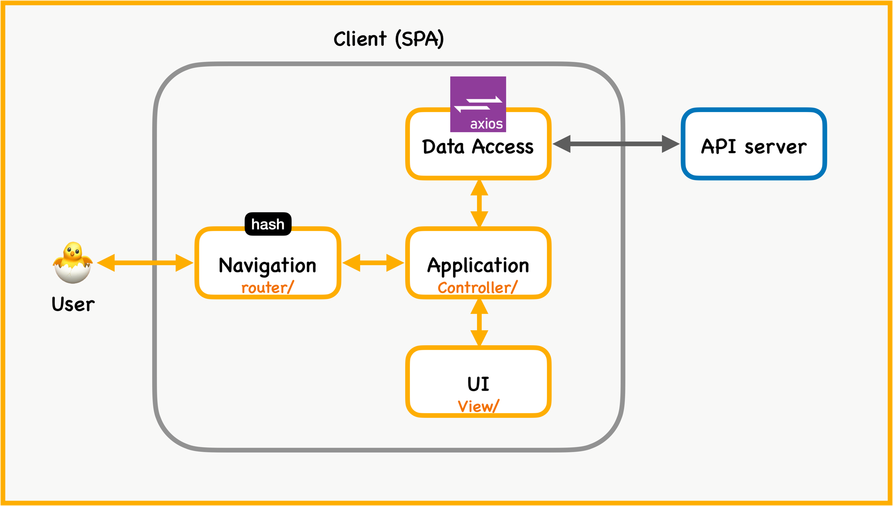

프론트 기술 역량을 강화하기 위해 JavaScript 기반 SPA 프로젝트를 진행했습니다. 요번 프로젝트를 진행하면서 리엑트, 뷰에서 사용하는 웹팩, 라우터 등의 기술이 왜 사용하는지, 어떤 원리로 동작되는지 배워볼 수 있었던 경험이였고 라이브러리를 사용하지 않고 순수 자바스크립트만을 이용해 여러 로직을 고민하며 웹개발자로서 한층 성장할 수 있는 기회였다고 생각합니다. <br>

글의 순서는 크게 아래와 같이 진행하겠습니다. 
1. SPA 개발에 사용한 기술 소개
2. 주요 로직

### SPA? 자바스크립트만으로 어떻게 개발하지
그동안 프론트 개발을 해오면서 리엑트, 뷰 라이브러리를 이용해 아무 생각 없이 코드를 짜다보니, 정작 SPA 기술이 어떻게 동작되는지 모르는 경우가 있습니다. 
이러한 상황에서 갑자기 자바스크립트만으로 개발이 주어진 경우 막연히 어렵게만 다가왔습니다. 그래서 진짜 라이브러리 도움없이 순수 자바스크립트만을 이용한 개발을 시도했습니다.

#### 그래서 선택한 방법이 `hash(Hash History)` 방식!
자바스크립트만으로 SPA 개발하는 방식은 크게 2가지가 있습니다. 하나는 history(Browser History), 또하나는 hash 를 이용해 SPA를 구현할 수가 있었습니다. 여기서 저는 `hash` 방식을 선택해서 프로젝트를 진행했습니다.

그 이유는 자바스크립트만으로 정적 웹서버에 배포를 해보고 싶었기 때문입니다. history 방식은 express 서버 구축이 필요했기에 저는 서버 구축이 필요없는 hash 방식을 선택했습니다.
### `hash` 사용해 SPA 개발해보자
크게 로직은 아래와 같은 구조로 진행되게 됩니다. 여기서 `hash` 는 User 요청의 도입부분인 라우터에 위치하게 됩니다. 


### 요청의 첫 시작은 `Navigation`
여기서 `hash` 의 역할이 궁금할껍니다. hash는 `#` 앵커를 통해 이동하는 방법으로 `site/#path` 와 같이 url이 표현됩니다. 보통 정적 페이지에서 사용되며 블로그의 주 제목을 클릭 후 앵커 이동 시 url에 `#`이 붙는 모습을 보실 수 있습니다.


```js
 window.addEventListener("hashchange", () => {
        router(window.location.hash);
    })
```


```js
const router = (route) => {
    rootContent.innerHTML = '';
    switch (route) {
        case '#/':
            return rootContent.appendChild(pages.home());
        case '#/detail':
            return rootContent.appendChild(pages.detail());
        case '#/post':
            return rootContent.appendChild(pages.post());
        default:
            return rootContent.appendChild(pages.notFound());
    }
}
```


`window.location.hash` 이용해 라우팅 변경이 되며 이는 hash 변경 시 `hashchange` 이벤트가 발생하기 때문에 라우팅이 가능해집니다. 
### `Controller` 원하는 페이지 생성되게끔 해주자
해당 hash에 맞는 경로로 이동 시 페이지를 보여주는 방법입니다. 위의 구조와 같이 라우팅을 거쳐 컨트롤러에 요청이 들어가지게 됩니다. 다음으로 요청에 맞는 페이지 생성을 위한 서비스 로직이 실행되게 됩니다.


```js
// 설명을 위한 최소한의 코드입니다. 해당 코드에 실제 axios를 이용한 데이터 처리 로직도 담게됩니다.
import views from '../views/post/post.html'

export default () => {
    const divElement = document.createElement('div')
    divElement.classList = "post-section";
    divElement.innerHTML = views;

    return divElement;
}
```


코드에 보실 수 있듯이 해당 엘레먼트를 생성 후 안에다 미리 생성된 `html` 뷰를 집어넣는 방식으로 페이지 교체가 진행되게 됩니다.

### 추가로 history(browser hisotry) 는?
url 형태는 `site/path` 와 같이 표현되며 이 방법은 **서버 측** 지원이 일부 필요합니다. 예를 들어 존재하지 않는 경로로 접속할 경우 오류를 출력하며 이런 문제를 해결하고 대체할 url은 서버에 지정해야 됩니다.

history API의 `pushstate` `popstate` 이벤트를 이용합니다. `history.pushstate` 통해 새 데이터 전달을 위한 상태, 제목, url 지정이 가능합니다.

### 느낀점
그동안 프레임워크, 라이브러리의 동작을 설명을 보고 단순히 기능 동작하는 개발만 했었는데 실제 이미 구현된 기능을 처음부터 개발을 해보면서 기능의 원리를 좀더 이해할 수 있었습니다. 그리고 짧은 시간 내 개발을 진행하며 테스트 및 사용자의 휴먼 에러를 많이 고려하지 않고 있다는 부분에서 아쉬웠습니다. 하지만 요번 프로젝트를 통해 개인적인 개발 성장을 달성했다는 점에서 재밌었던 프로젝트였다고 생각합니다. 

> 코드가 궁금하시다면? <br>
> [GitHub](https://github.com/hyunolike/vanillajs-based-spa)


